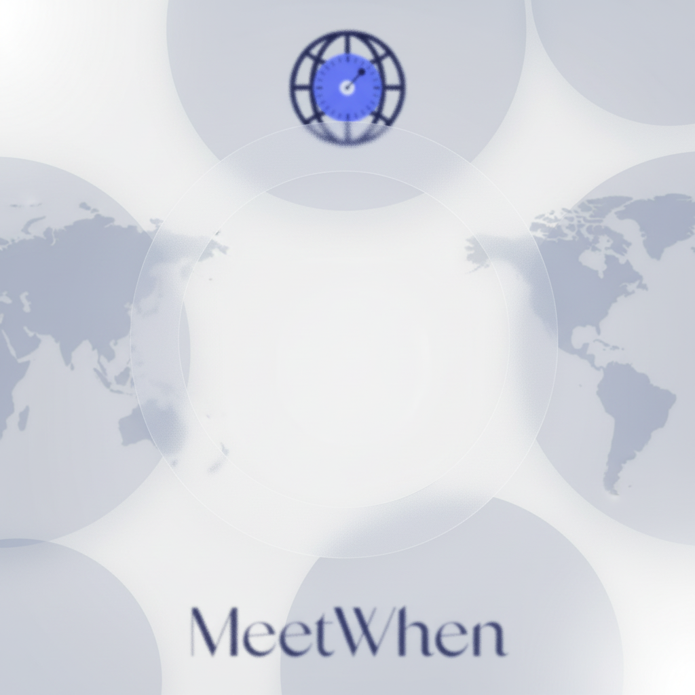
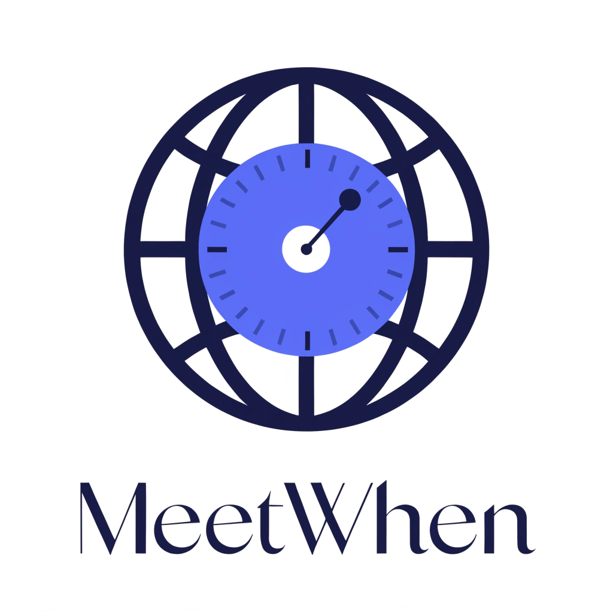

# 🌍 MeetWhen (ZoneSync)

> 一个现代化的跨平台时区可视化与日程调度应用，帮你轻松找到跨国团队的“黄金交集时间”。

!\[Version]\(https\://img.shields.io/badge/version-1.0.0-blue.svg null)
!\[React Native]\(https\://img.shields.io/badge/React\_Native-0.74-61DAFB.svg?logo=react null)
!\[Expo]\(https\://img.shields.io/badge/Expo-51.0-000020.svg?logo=expo null)
!\[Platform]\(https\://img.shields.io/badge/platform-iOS%20%7C%20Android-lightgrey.svg null)

## ✨ 项目简介

在全球化协作日益频繁的今天，计算不同时区朋友、客户或同事的当地时间常常令人头疼。**MeetWhen** 致力于解决这一痛点，通过直观的卡片式 UI 和全局时间滑块，让你通过简单的滑动操作，瞬间穿越时区，找到完美的会议或联系时间。

## 🚀 核心功能 (Features)

- **⏱ 全局时间穿梭 (Time Travel Slider)：** 底部毛玻璃控制岛，单指滑动即可全局推算所有联系人的未来时间。
- **🌗 昼夜智能感知 (Day/Night Indicator)：** 卡片背景根据当地时区的昼夜状态自动变色，直观判断对方是否处于休息时间。
- **📇 联系人管理：** 支持搜索全球核心城市，快速添加联系人及专属国家/地区 Emoji 国旗。
- **💨 原生级交互手势：** 深度集成 `react-native-gesture-handler`，拥有丝滑的原生左滑删除体验。
- **💾 本地数据持久化：** 基于 `AsyncStorage`，重启应用数据不丢失。
- **📱 跨平台支持：** 一套代码，同时完美运行在 iOS 和 Android 终端。

## 🛠 技术栈 (Tech Stack)

- **框架：** React Native / Expo
- **路由：** React Navigation (Native Stack)
- **时间与时区处理：** Day.js (`dayjs/plugin/utc`, `dayjs/plugin/timezone`)
- **UI 与动画：** Expo Blur (毛玻璃特效), React Native Gesture Handler
- **数据存储：** AsyncStorage

## 📸 界面预览 (Screenshots)

*(提示：你可以在这里放两张 App 运行时的截图，上传到 GitHub 仓库的* *`assets`* *文件夹中，然后替换下面的链接)*

<div align="center">
  
  &nbsp;&nbsp;&nbsp;&nbsp;
  
</div>

## 💻 本地运行指南 (Getting Started)

### 环境要求

请确保你的电脑上已经安装了 [Node.js](https://nodejs.org/)。

### 安装与启动

1. **克隆项目到本地**
   ```bash
   git clone [https://github.com/你的用户名/MeetWhen.git](https://github.com/你的用户名/MeetWhen.git)
   cd MeetWhen
   ```

